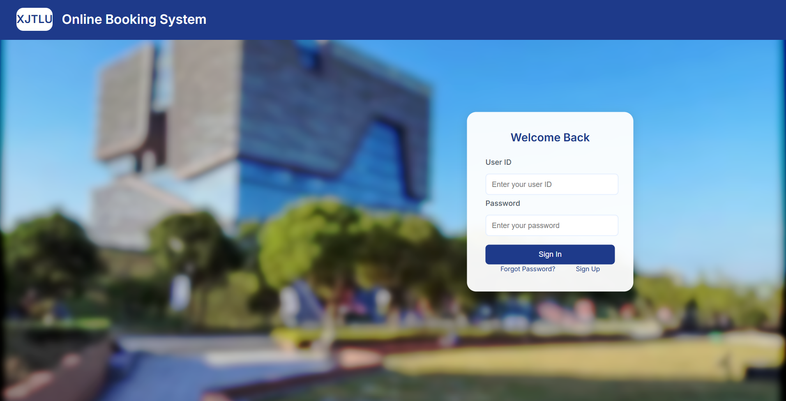
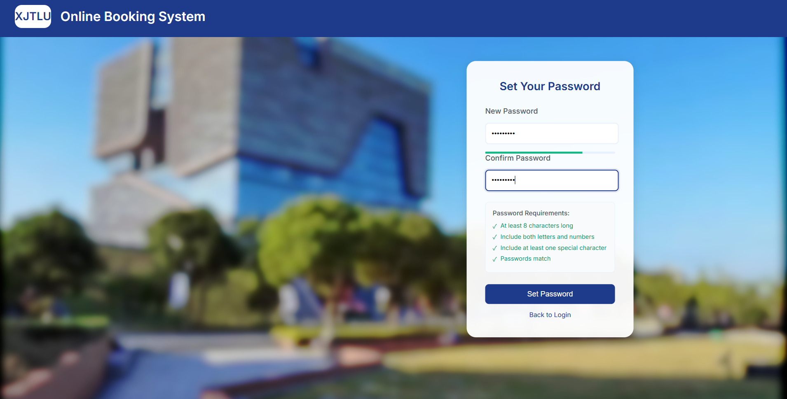
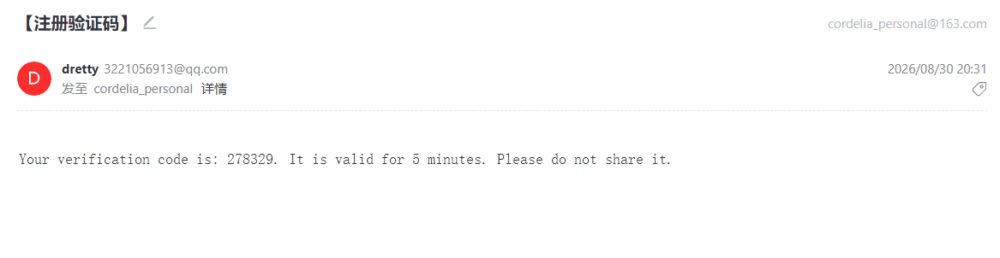
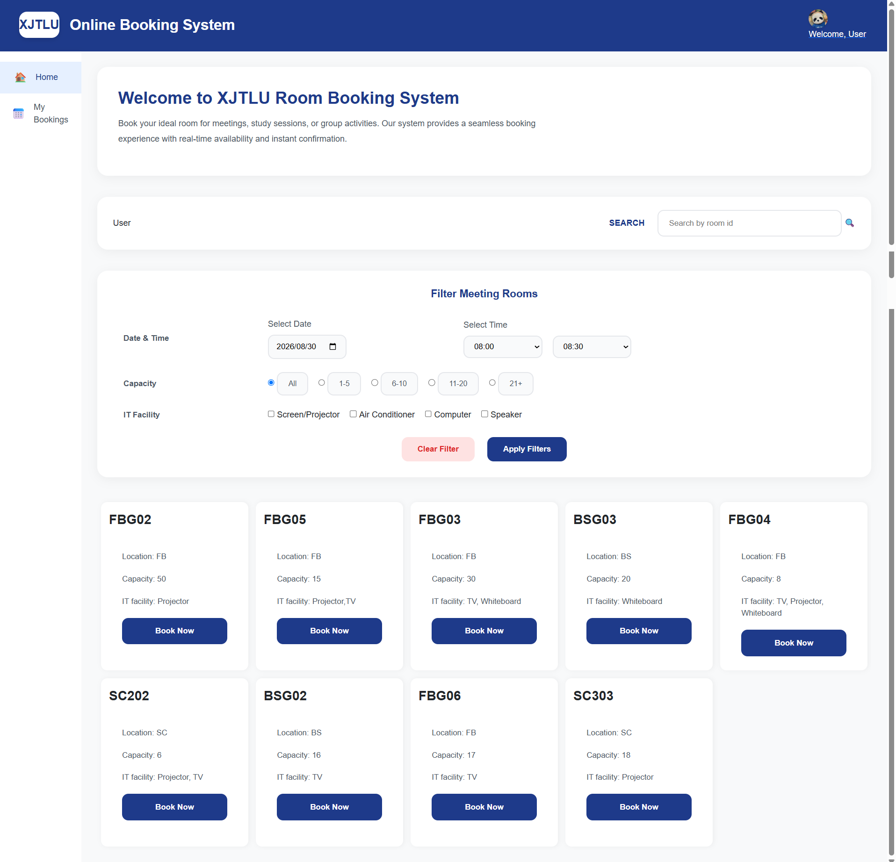
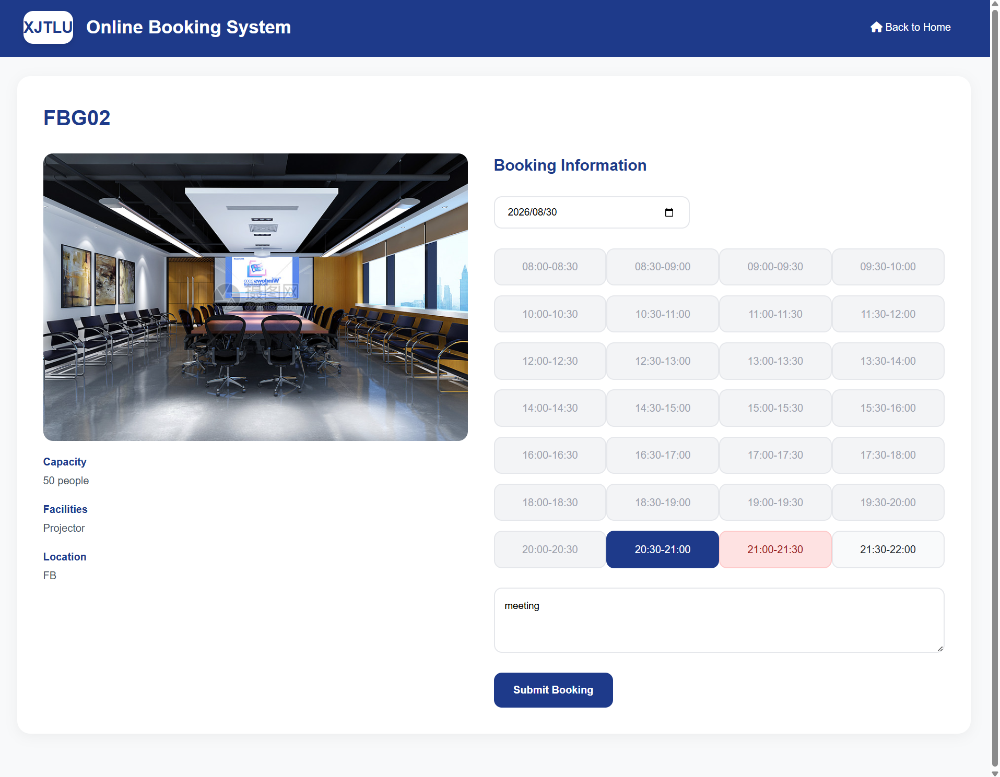
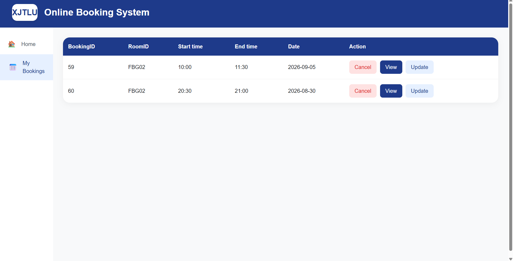
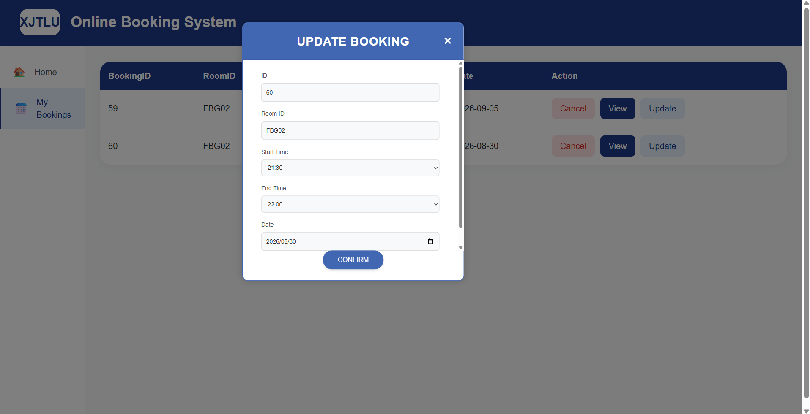
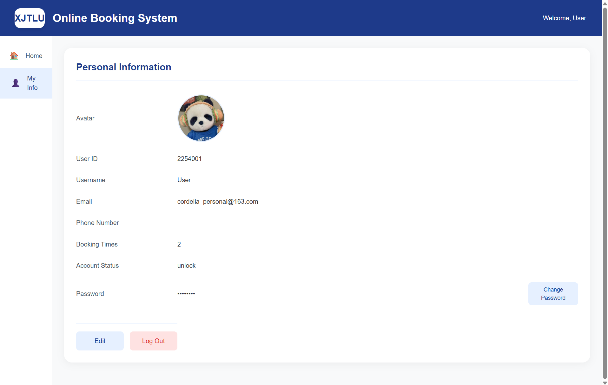
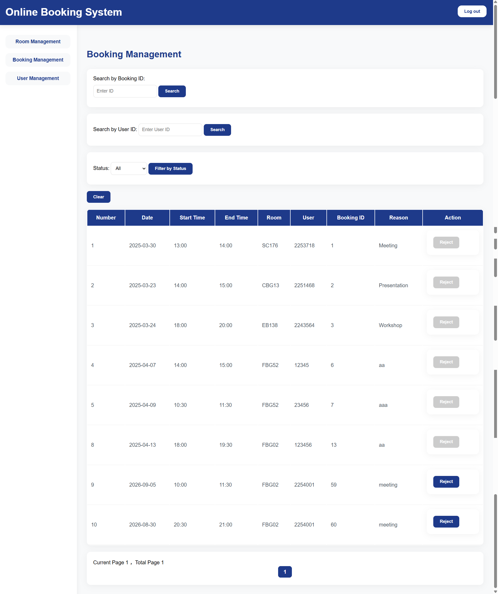

# Online Meeting Room Booking System

A full-stack web application for campus meeting-room booking: student registration with email verification, room search and booking, personal booking management, and an admin console for rooms, bookings, and user accounts.

> Built with **Spring Boot + Thymeleaf + MySQL**.  

---

## Features

| User | Admin |
| --- | --- |
| Register with university ID, email, and password | Maintain the meeting-room catalog (image, ID, capacity, IT facilities, location) |
| Email verification code to activate the account | Search / filter rooms; add, update, delete rooms |
| Login / logout, session-based access | View all bookings; search by booking ID or user; filter by status |
| Search rooms by ID; filter by date/time, capacity, IT facilities | Reject bookings |
| Book 30-minute slots, see occupied slots on a timetable | Lock / unlock accounts for excessive booking |
| View, update, or cancel bookings before the meeting starts | |
| Edit profile, upload avatar, change password | |

---

## Tech stack

**Backend**

- Java 17, Spring Boot 3.4 (Spring MVC)
- Spring Data JPA + Hibernate (`ddl-auto=update`)
- MySQL 8
- Redis (temporary storage for registration / verification tokens)
- Spring Mail (QQ SMTP) for 6-digit verification codes
- Spring Security Crypto — BCrypt password hashing
- HttpSession for logged-in user state

**Frontend**

- Thymeleaf server-side templates
- HTML / CSS / JavaScript
- Responsive campus-style UI (Inter font, card layout)

**Build & run**

- Maven (wrapper: `mvnw.cmd`)
- Embedded Tomcat on port `8080`

**Architecture**

```
Browser (Thymeleaf pages)
    → Controller (MVC)
        → Service
            → Repository (JPA)
                → MySQL
            → Redis / Mail (verification)
```

Layered package layout: `Controller` / `Service` / `Repo` / `dto` / `config` / `util`.

---

### 1. Login

**Route:** `http://localhost:8080/login`

Students sign in with university **User ID** and password. Links to forgot-password and sign-up. Failed login shows “ID does not exist” or “Incorrect password”. After success the session is stored and the user is redirected to `/welcome`.

**Stack:** Thymeleaf + Spring MVC `@PostMapping("/login")` + BCrypt `PasswordEncoder` + `HttpSession`.



### 2. Register, email code, set password

Only students whose ID exists in the `student` whitelist table can register. The user submits ID + email; the system emails a 6-digit code (valid 5 minutes). After verification, the user sets a password that must be at least 8 characters, mix letters and numbers, and include a special character.

**Stack:** Spring Mail, in-memory cooldown cache + Redis token for the verified user, Thymeleaf forms.





### 3. Home — room listing & filters 

After login, users see all rooms as cards (ID, location, capacity, IT facilities). They can search by room ID and filter by date/time, capacity bands (1–5, 6–10, 11–20, 21+), and facilities (projector, air conditioner, computer, speaker).

**Stack:** Thymeleaf + CSS cards, `UserSearchRoomController`, JPA queries on `room`.



### 4. Book a room

Shows room photo, capacity, facilities, location, and a half-hour timetable for the chosen date. Occupied slots are marked in red and the past time slots are marked in grey; free slots can be selected. User enters a booking reason and submits.

**Stack:** Thymeleaf + JS slot picker, `BookingController` / `ScheduleService`, overlap checks against `booking` / `schedule` tables.



### 5. My bookings

Lists the current user’s bookings (Booking ID, Room ID, start/end, date) with **Cancel**, **View**, and **Update**. Users may change or cancel a booking before the meeting starts.

**Stack:** Thymeleaf table + `UserControllBooking` / `BookingService` + HTML modal + form POST, session user id.






### 6. Personal information 

Shows avatar, user ID, username, email, phone, booking count, account status (lock/unlock), and password (masked). Users can edit profile, upload an avatar (stored under the local `booking-system/avatars` directory), change password, or log out.

**Stack:** Thymeleaf, multipart upload, `UserController`, static resource mapping in `WebConfig` / `AvatarConfig`.



### 7. Admin — room management

**Route:** `http://localhost:8080/admin/room`

Admin catalog: search by room ID, filter by IT facility, availability, building location, capacity range, and whether the room has an image. Actions: **Add New Room**, **Update**, **Delete**.

**Stack:** Thymeleaf admin layout, `adminRoomController`, multipart room images, JPA `Room` entity.


### 9. Admin — booking management 

**Route:** `http://localhost:8080/admin/booking`

Review all bookings (paginated). Search by booking ID or user, filter by status, and remove a booking (reject / cancel on behalf of the system).

**Stack:** Spring Data `Pageable`, `adminBookingController`, Thymeleaf `bookingList.html`.



### 10. Admin — user management 

**Route:** `http://localhost:8080/admin/users`

Search users by name / email / phone. Filter by lock status and booking-count range. **Toggle Status** locks or unlocks an account. Batch actions reset all booking counters and unlock everyone (e.g. start of a new term).

**Stack:** `adminUserController`, projection `UserView` (password not exposed in the list).


---


